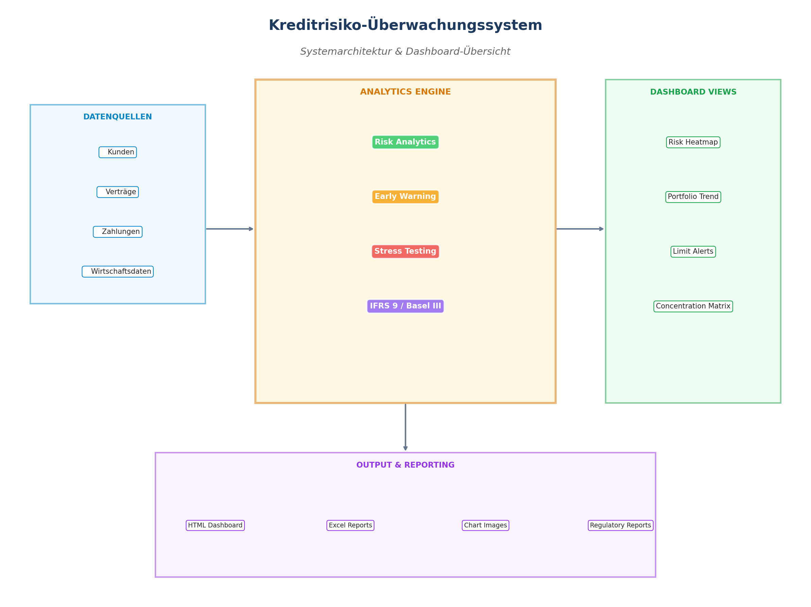
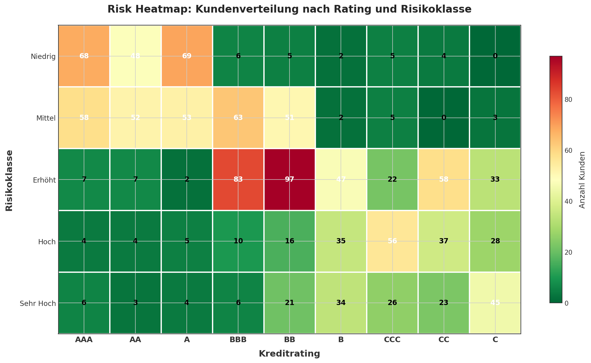
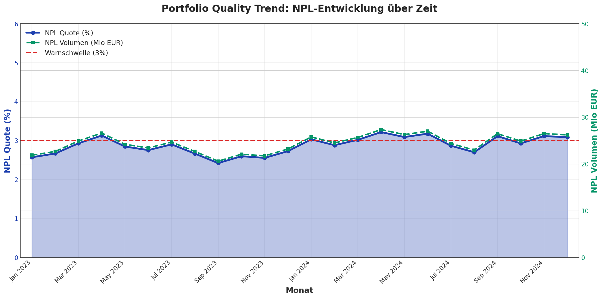
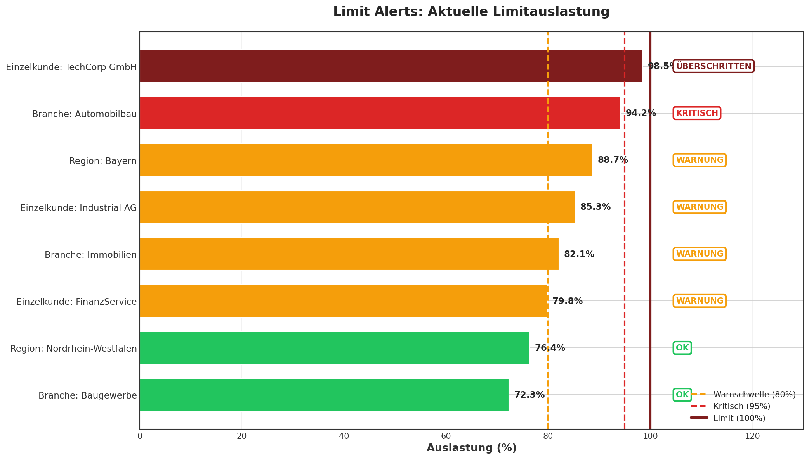
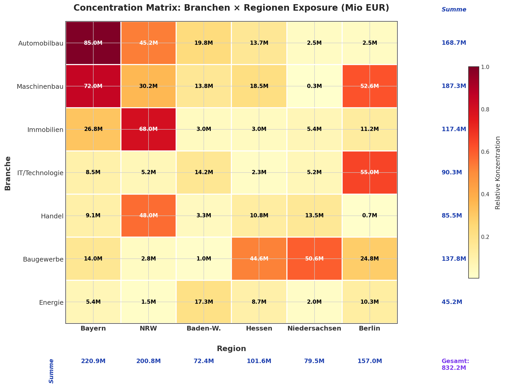

# Kreditrisiko-Überwachungssystem

**Credit Risk Monitoring System** - A comprehensive system for monitoring credit risk exposure across multiple credit portfolios with early warning capabilities for potential defaults.

## Features

### Core Functionality

- **Portfolio Analytics**: Complete portfolio overview with exposure analysis, rating distribution, and key risk metrics
- **Concentration Risk**: Analysis of customer, industry, and regional concentrations with limit monitoring
- **Early Warning System**: Automated detection of payment delays, rating downgrades, and high limit utilization
- **Stress Testing**: Multiple predefined scenarios including interest rate shocks, recession scenarios, and industry-specific crises
- **IFRS 9 ECL Calculation**: Full Expected Credit Loss calculation with proper stage classification
- **Basel III/IV Capital Requirements**: Risk-weighted asset calculation and capital requirement reporting
- **Dashboard & Reporting**: Interactive HTML dashboards and comprehensive Excel reports

### Data Model

The system includes the following core tables:

| Table | Description |
|-------|-------------|
| `kunden` | Customer master data with ratings and risk classification |
| `kredit_vertraege` | Credit contracts with terms, limits, and risk parameters |
| `zahlungen` | Payment records with delinquency tracking |
| `ausfall_ereignisse` | Default events and recovery tracking |
| `wirtschaftsdaten` | Economic indicators for risk analysis |
| `risiko_limits` | Risk limits by customer, industry, region |
| `rating_historie` | Rating change history |
| `rueckstellungen` | IFRS 9 provisions |

## Installation

### Prerequisites

- Python 3.8 or higher
- pip package manager

### Setup

```bash
# Clone the repository
git clone <repository-url>
cd Credit-Risk--Monitoring-System

# Install dependencies
pip install -r requirements.txt

# Initialize demo system with sample data
python main.py setup-demo

# Or initialize production system
python main.py setup-real
```

## Usage

### Command Line Interface

```bash
# Interactive menu
python main.py

# Direct commands
python main.py setup-demo          # Setup demo system with test data
python main.py setup-real          # Setup production system
python main.py analyze             # Run portfolio analysis
python main.py early-warning       # Run early warning checks
python main.py stress-test         # Run stress tests
python main.py regulatory          # Generate regulatory reports
python main.py dashboard           # Generate dashboards
python main.py full-report         # Generate complete report

# Specify mode (demo or real data)
python main.py analyze --mode real
```

### Python API

```python
from src.database import get_demo_db
from src.risk_analytics import RiskAnalytics
from src.early_warning import EarlyWarningSystem

# Initialize
db = get_demo_db()
analytics = RiskAnalytics(db)

# Get portfolio summary
summary = analytics.get_portfolio_summary()
print(f"Total Exposure: {summary['gesamt_exposure']:,.2f} EUR")

# Run early warning checks
ews = EarlyWarningSystem(db)
alerts = ews.run_all_checks()
print(f"Total Alerts: {len(alerts)}")
```

## Project Structure

```
Credit-Risk--Monitoring-System/
├── main.py                     # Main application entry point
├── requirements.txt            # Python dependencies
├── config/
│   ├── __init__.py
│   └── config.py              # Configuration settings
├── sql/
│   └── schema.sql             # Database schema
├── src/
│   ├── __init__.py
│   ├── database.py            # Database management
│   ├── demo_data_generator.py # Synthetic data generation
│   ├── economic_data_fetcher.py # Real economic data fetching
│   ├── risk_analytics.py      # Core risk calculations
│   ├── early_warning.py       # Early warning system
│   ├── stress_testing.py      # Stress testing scenarios
│   ├── regulatory_reporting.py # IFRS 9 & Basel III reports
│   ├── dashboard.py           # Dashboard generation
│   └── excel_handler.py       # Excel import/export
├── data/
│   ├── demo/                  # Demo database
│   ├── real/                  # Production database
│   └── excel_templates/       # Excel templates for data import
├── dashboards/                # Generated dashboards
└── reports/                   # Generated reports
```

## Key Analyses

### 1. Concentration Risk Analysis

- **Top 10 Exposures**: Largest customer exposures with portfolio share
- **Industry Concentration**: >30% limit monitoring
- **Regional Concentration**: Geographic risk distribution
- **Concentration Matrix**: Industry × Region breakdown

### 2. Portfolio Quality Metrics

- **NPL Ratio**: Non-Performing Loans as % of total portfolio
- **Coverage Ratio**: Provisions to NPL coverage
- **Expected vs. Actual Loss**: Model validation
- **Vintage Analysis**: Performance by origination cohort

### 3. Early Warning Indicators

- Contracts with >30 days payment delay
- Rating downgrades in last 90 days
- Credit facilities with >80% utilization
- Multiple risk factor accumulation

### 4. Stress Testing Scenarios

| Scenario | Description | PD Impact |
|----------|-------------|-----------|
| Interest Rate +200bps | Interest rate shock | 1.3x |
| Mild Recession | Moderate downturn | 1.5x |
| Severe Recession | Major downturn (+3% default) | 2.5x |
| Auto Industry Crisis | Sector-specific shock | 3.0x (Auto) |
| Real Estate Crisis | Property market crash | 3.5x (RE) |
| Combined Stress | Multiple factors | 3.0x |

### 5. Regulatory Reports

- **IFRS 9 ECL**: Stage classification (1/2/3) and ECL calculation
- **Basel III RWA**: Risk-weighted assets by exposure class
- **Large Exposure Report**: Exposures >10% of capital
- **Capital Requirements**: CET1, Tier 1, Total Capital

## Excel Templates

Templates are generated in `data/excel_templates/`:

- `vorlage_kunden.xlsx` - Customer data import
- `vorlage_vertraege.xlsx` - Contract data import
- `vorlage_zahlungen.xlsx` - Payment data import
- `vorlage_wirtschaftsdaten.xlsx` - Economic data import

Each template includes:
- **Anleitung** (Instructions): Field descriptions and requirements
- **Data Sheet**: Sample data with correct formatting
- **Referenzdaten**: Valid values for dropdown fields

## System Overview

The Credit Risk Monitoring System provides comprehensive portfolio analytics with regulatory compliance features:



The system processes data from multiple sources (customers, contracts, payments, economic indicators) through its analytics engine and generates various dashboard views and reports.

---

## Dashboard Views

The system generates four main dashboard visualizations for comprehensive risk monitoring:

### 1. Risk Heatmap

**Purpose:** Visualize customer distribution across rating classes and risk categories



The Risk Heatmap displays:
- **X-axis**: Credit ratings from AAA (lowest risk) to C (highest risk)
- **Y-axis**: Risk classes (niedrig → sehr_hoch)
- **Cell values**: Number of customers in each category
- **Color intensity**: Indicates concentration (green = low, red = high)

**Use Cases:**
- Identify portfolio concentrations in specific risk segments
- Monitor rating migrations over time
- Support limit setting and risk appetite decisions

---

### 2. Portfolio Quality Trend

**Purpose:** Track Non-Performing Loan (NPL) development over time



The Portfolio Quality Trend shows:
- **Blue line**: NPL ratio as percentage of total portfolio
- **Green dashed line**: NPL volume in million EUR
- **Red threshold**: Warning level at 3% NPL ratio
- **Time range**: Rolling 24-month view

**Key Metrics:**
- NPL Quote (%) = Non-Performing Loans / Total Exposure
- NPL Volume = Absolute amount of non-performing exposures
- Trend direction indicates portfolio health trajectory

---

### 3. Limit Alerts

**Purpose:** Monitor current limit utilization and breaches



The Limit Alerts dashboard displays:
- **Limit types**: Single customer, industry, and regional limits
- **Utilization bars**: Visual representation of current usage
- **Status badges**:
  - **OK** (green): < 80% utilization
  - **WARNUNG** (orange): 80-95% utilization
  - **KRITISCH** (red): 95-100% utilization
  - **ÜBERSCHRITTEN** (dark red): > 100% - limit exceeded

**Threshold Lines:**
- 80%: Warning threshold
- 95%: Critical threshold
- 100%: Hard limit

---

### 4. Concentration Matrix

**Purpose:** Analyze exposure distribution across industries and regions



The Concentration Matrix shows:
- **Rows**: Industry sectors (Automobilbau, Maschinenbau, etc.)
- **Columns**: German regions (Bayern, NRW, etc.)
- **Cell values**: Exposure in million EUR
- **Color intensity**: Relative concentration level
- **Row/Column totals**: Aggregated exposures

**Concentration Limits:**
- Industry maximum: 30% of total portfolio
- Region maximum: 40% of total portfolio
- Single customer maximum: 10% of total portfolio

---

## Generating Visualizations

To regenerate the documentation visualizations:

```bash
# Install matplotlib if not present
pip install matplotlib pandas numpy

# Generate visualizations
python generate_docs_visualizations.py
```

The images will be saved to `docs/images/`

## Configuration

Key configuration in `config/config.py`:

```python
# Risk Parameters
RATING_PD = {
    'AAA': 0.0001,
    'BBB': 0.0045,
    'B': 0.09,
    ...
}

# Concentration Limits
SINGLE_CUSTOMER_MAX = 10.0  # 10% per customer
INDUSTRY_MAX = 30.0          # 30% per industry
REGION_MAX = 40.0            # 40% per region

# IFRS 9 Stage Thresholds
STAGE_1_MAX_DPD = 30         # Days past due for Stage 1
STAGE_2_MAX_DPD = 90         # Days past due for Stage 2
```

## Demo vs. Real Mode

### Demo Mode
- Uses synthetic data generated by `demo_data_generator.py`
- 500 customers, 1500 contracts, 10000 payments
- Includes realistic German company names and regions
- Suitable for testing and demonstration

### Real Mode
- Uses production database for actual data
- Economic data fetched from ECB, Eurostat, World Bank APIs
- Import data via Excel templates
- Suitable for production use

## API Data Sources

The system can fetch real economic data from:
- **ECB**: Interest rates, monetary policy data
- **Eurostat**: Unemployment, GDP, inflation
- **World Bank**: GDP growth, economic indicators

Note: Some API endpoints may have access restrictions.

## License

This project is provided as-is for educational and demonstration purposes.

## Contributing

Contributions are welcome. Please ensure:
- Code follows existing patterns
- German terminology is used consistently
- All new features include appropriate tests

## Support

For issues and feature requests, please open a GitHub issue.
